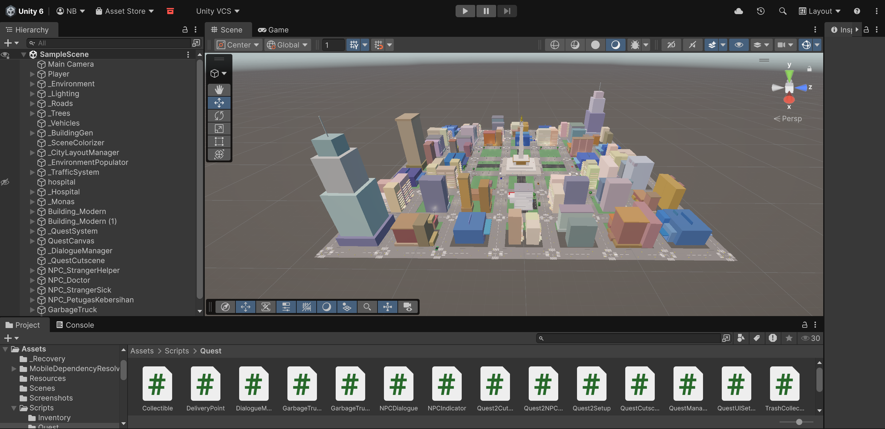
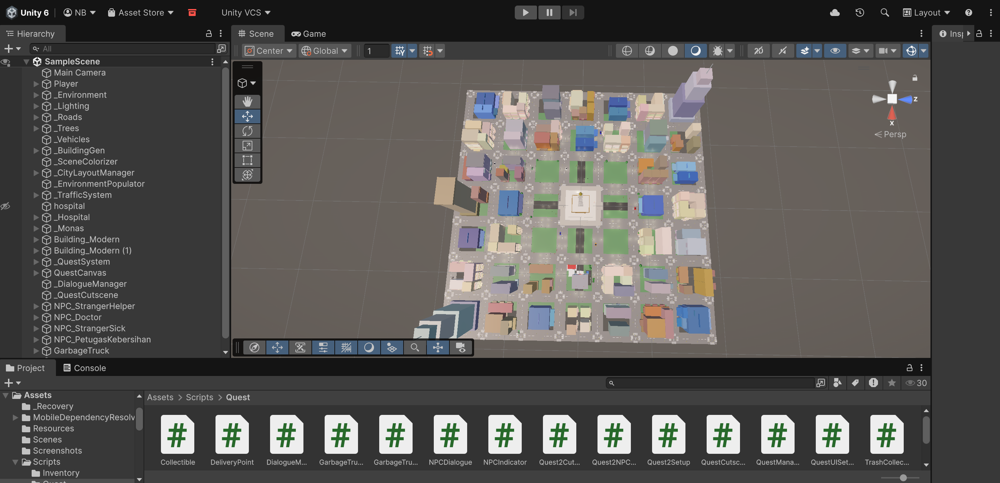
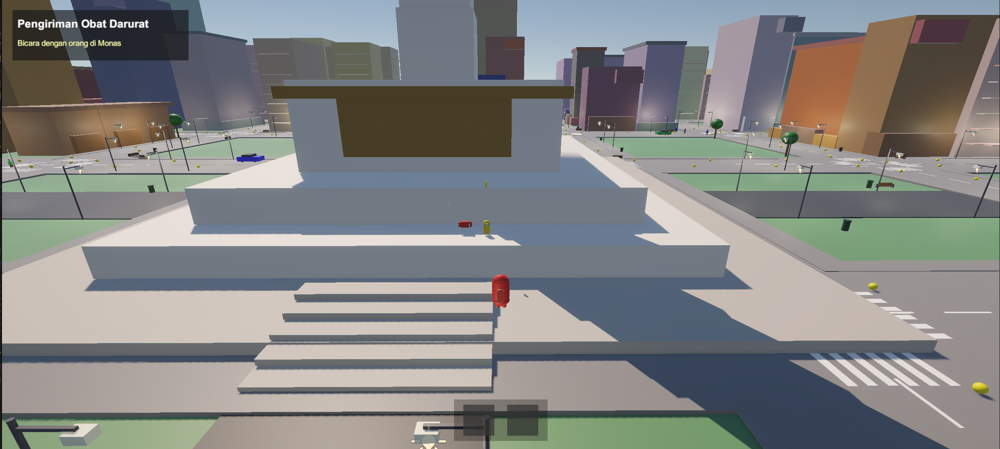
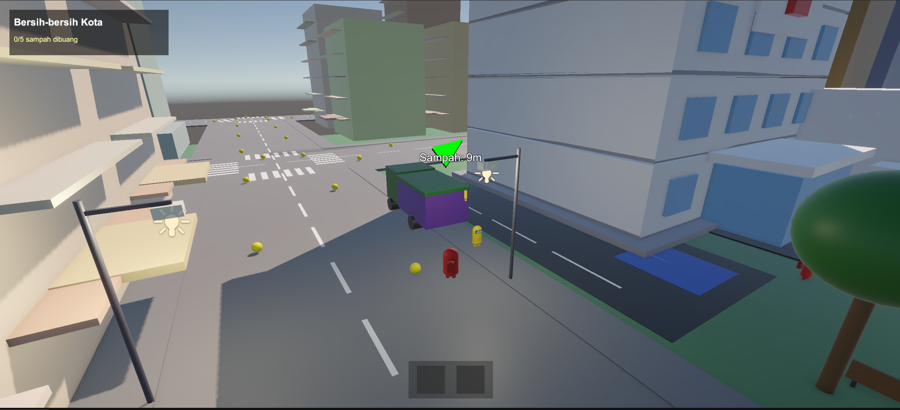

# Kind City

A wholesome city adventure game where you help citizens and make the world a better place.

---

## Screenshots

<!-- Add your screenshots here - place images in docs/images/ folder -->

| Screenshot 1 | Screenshot 2 |
|:---:|:---:|
|  |  |

| Screenshot 3 | Screenshot 4 |
|:---:|:---:|
|  |  |

---

## About

**Kind City** is a quest-based adventure game set in a vibrant urban environment. Play as a helpful citizen completing quests, interacting with NPCs, and making a positive impact on your community.

### Features

- **Quest System** - Multiple quests with unique storylines and objectives
- **NPC Interactions** - Talk to various characters including doctors, helpers, and city workers
- **Dialogue System** - Engaging conversations with branching dialogue
- **Inventory System** - Collect and manage items throughout your journey
- **Traffic System** - Dynamic city traffic with waypoint-based vehicle AI
- **Procedural City** - Buildings, roads, and environment generated dynamically
- **Among Us-style Characters** - Cute bean-shaped character models

### Quests

1. **Quest 1** - Help a stranger in need
2. **Quest 2** - Garbage collection with the cleaning officer

---

## How to Play

### Controls

| Action | Key |
|--------|-----|
| Move | WASD / Arrow Keys |
| Interact | E |
| Open Inventory | I / Tab |
| Cancel/Back | Escape |

### Objectives

1. Explore the city and find NPCs with quest markers
2. Talk to NPCs to receive quests
3. Complete objectives and return to the quest giver
4. Help as many citizens as you can!

---

## Requirements

- **Unity 6** (6000.0.x or later)
- **Git**

## Quick Start

### 1. Clone Repository
```bash
git clone https://github.com/Yeyodra/Grafkom.git
```

### 2. Open in Unity Hub
1. Open **Unity Hub**
2. Click **Add** > **Add project from disk**
3. Select the cloned `Grafkom` folder
4. Click the project to open

### 3. Open Scene
- Open `Assets/Scenes/SampleScene.unity`
- Press Play to test

---

## Project Structure

```
Assets/
├── Scripts/
│   ├── PlayerController.cs      # Player movement & input
│   ├── AmongUsPlayer.cs         # Character visuals
│   ├── CameraFollow.cs          # Camera system
│   ├── Quest/
│   │   ├── QuestManager.cs      # Quest logic
│   │   ├── DialogueManager.cs   # Dialogue system
│   │   ├── NPCDialogue.cs       # NPC conversations
│   │   ├── QuestCutscene.cs     # Cutscene handling
│   │   ├── GarbageTruck.cs      # Quest 2 vehicle
│   │   └── ...
│   ├── Inventory/
│   │   ├── InventoryManager.cs  # Item management
│   │   └── InventoryUI.cs       # Inventory display
│   ├── UI/
│   │   ├── FloatingIndicator.cs # Quest markers
│   │   └── TrashPointer.cs      # Collection pointer
│   ├── BuildingGenerator.cs     # Procedural buildings
│   ├── CityLayoutManager.cs     # City generation
│   ├── TrafficSystem.cs         # Vehicle AI
│   └── ...
├── Scenes/
│   └── SampleScene.unity
└── ...
```

---

## Git Workflow

### Before starting work
```bash
git pull
```

### After finishing work
```bash
git add .
git commit -m "Description of changes"
git push
```

### If there are conflicts
```bash
git pull --rebase
# Fix conflicts in affected files
git add .
git rebase --continue
git push
```

---

## Technical Details

- **Engine:** Unity 6 (URP)
- **Platform:** PC
- **Genre:** Adventure / Simulation

---

## Credits

**Game Design & Development**
- Yeyodra

**Assets**
- [List your asset sources here]

**Special Thanks**
- [Acknowledgements]

---

## License

[Your License Here]

---

<p align="center">
  Made with Unity
</p>
